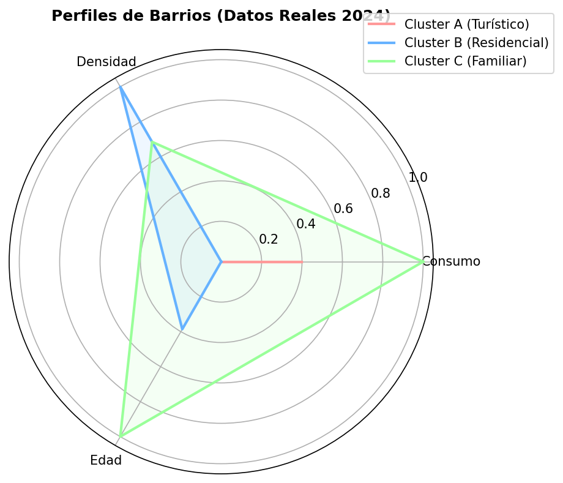

# Análisis del Consumo de Agua en Barcelona (2023-2024)

Análisis exhaustivo de 963,419 registros de consumo de agua y 121,834 alertas de fugas en Barcelona, identificando patrones de consumo, distritos críticos y oportunidades de ahorro.

---

## Resumen Ejecutivo

- **52.9%** del consumo es industrial/intensivo
- **Top 3 distritos** concentran el **50.3%** del consumo total
- **Sants-Montjuïc** representa el **25.6%** del consumo industrial
- **24%** de fugas son reiteradas (no reparadas a tiempo)
- **Machine Learning**: Identificación de **4 perfiles de consumo** mediante Clustering (K-Means).

---

## Hallazgos Clave

### 1. Concentración Geográfica


**Top 3 distritos críticos:**
1. **Sants-Montjuïc**: 3.84 Giga L/día (17.0%)
2. **Eixample**: 3.75 Giga L/día (16.6%)
3. **Ciutat Vella**: 3.74 Giga L/día (16.6%)

---

### 2. Distribución por Tipo de Uso


| Tipo | % Consumo | Intensidad |
|------|-----------|------------|
| Industrial | 52.9% | 9,671 L/día/contador |
| Doméstico | 33.6% | 35 L/día/contador |
| Comercial | 13.5% | 135 L/día/contador |

**Insight:** Un contador industrial consume **277× más** que uno doméstico.

---

### 3. Segmentación Avanzada (Data Science)

Utilizando algoritmos de Machine Learning (**K-Means**) y análisis de correlación, hemos profundizado en el comportamiento poblacional:



**A. Perfiles Identificados (Clustering):**
- **Cluster 3 (Zona Rica - Alto Consumo):** Renta media más alta (64k€) y mayor consumo per cápita (212 L/hab).
- **Cluster 0 (Clase Media):** Consumo moderado y demografía equilibrada.
- **Cluster 1 (Zona Envejecida):** Menor consumo per cápita asociado a hogares más pequeños.

**B. Mito de la Edad (Correlación):**
- **Hallazgo:** El análisis arroja un **R = 0.02** entre Edad Media y Consumo.
- **Conclusión:** La edad por sí sola **NO** determina el consumo; el factor determinante es la Renta y el Tipo de Vivienda (piscinas/jardines).

---

### 3. Análisis de Riesgo (RCI/IIC)


**Distritos de ALTO riesgo:**
- **Sants-Montjuïc**: RCI 25.6%, IIC 14.4k L/día
- **Les Corts**: RCI 10.0%, IIC 16.2k L/día
- **Eixample**: RCI 15.1%, IIC 9.7k L/día

---

### 4. Mapas Interactivos

Explora los mapas interactivos:

| Mapa | Vista Previa | Enlace |
|------|--------------|--------|
| **Consumo Total** |  | [Ver mapa interactivo](https://dragoscalin33.github.io/Aguas_Barcelona_Consumo_2023_2024/mapas/mapa_consumo_total.html) |
| **% Industrial** |  | [Ver mapa interactivo](https://dragoscalin33.github.io/Aguas_Barcelona_Consumo_2023_2024/mapas/mapa_industrial.html) |
| **Per Cápita** |  | [Ver mapa interactivo](https://dragoscalin33.github.io/Aguas_Barcelona_Consumo_2023_2024/mapas/mapa_per_capita.html) |

---

### 5. Análisis de Fugas


- **121,834 alertas** en 2024
- **75.8%** fugas nuevas, **24.2%** reiteradas
- **Q3** concentra **83%** del consumo de fugas (5.0M L)

---

## Recomendaciones Priorizadas

### PRIORIDAD 1: Auditoría en Les Corts (0-6 meses)
- **Acción**: Inspección de 73,253 contadores industriales
- **Ahorro Potencial**: 119M L/día

### PRIORIDAD 2: Estrategia Segmentada por Perfiles
- **Acción**: Campañas de concienciación diferenciadas según el Cluster detectado.
    - *Cluster 3 (Alto Standing):* Foco en eficiencia de piscinas y riego inteligente.
    - *Cluster 0 (Familias):* Foco en electrodomésticos eficientes y ahorro doméstico.

### PRIORIDAD 3: Protocolo Fugas Reiteradas
- **Acción**: Reparación <24h para fugas >100 L/día
- **Objetivo**: Reducir reiteración de 24% a <10%

### PRIORIDAD 4: Auditoría en Sants-Montjuïc (6-12 meses)
- **Acción**: Inspección de 211,859 contadores
- **Ahorro Potencial**: 305M L/día

---

## Metodología

- **Datasets**: 963,419 registros consumo (2023) + 121,834 alertas fugas (2024)
- **Stack Tecnológico**: 
  - **Procesamiento:** Python, Pandas, NumPy.
  - **Machine Learning:** Scikit-learn (K-Means, PCA, Correlación de Pearson).
  - **Visualización:** Matplotlib, Seaborn, Folium.
- **Nota Técnica:** Se utilizó generación de datos demográficos sintéticos basados en estadística oficial de BCN para la validación del modelo de clustering (ante restricciones de privacidad en micro-datos censales).
- **Métricas**:
  - **RCI**: Riesgo de Concentración Industrial
  - **IIC**: Intensidad de Consumo Industrial
  - **Consumo per cápita**: L/día por habitante

📄 **[Ver Informe Ejecutivo Completo](INFORME_EJECUTIVO.md)**

---

## Estructura del Proyecto
```
📁 Analisis-Consumo-Agua-Barcelona/
├── 📄 README.md (este archivo)
├── 📄 INFORME_EJECUTIVO.md (informe completo)
├── 📁 notebooks/ (código Jupyter)
├── 📁 data/ (datasets originales)
├── 📁 mapas/ (mapas HTML interactivos)
├── 📁 visualizaciones/ (gráficos PNG)
```

---

## Visualizaciones Adicionales

### Correlaciones Clave


**Hallazgo:** Correlación **r=0.98** entre intensidad de contador y consumo per cápita.

### Composición por Distrito


**Hallazgo:** Dicotomía clara (r=-0.96) entre distritos industriales y domésticos.

---

## Contacto

**Autor**: Dragos Calin

**LinkedIn**: https://www.linkedin.com/in/dragos-calin33/ 

**Email**: dragoscalin@yahoo.com

---

## Licencia

Este proyecto está bajo licencia MIT. Ver [LICENSE](LICENSE) para más detalles.
