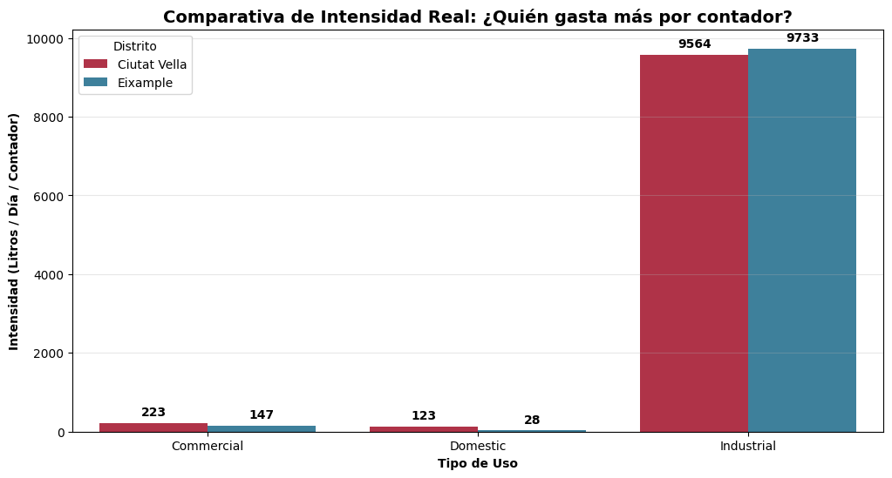
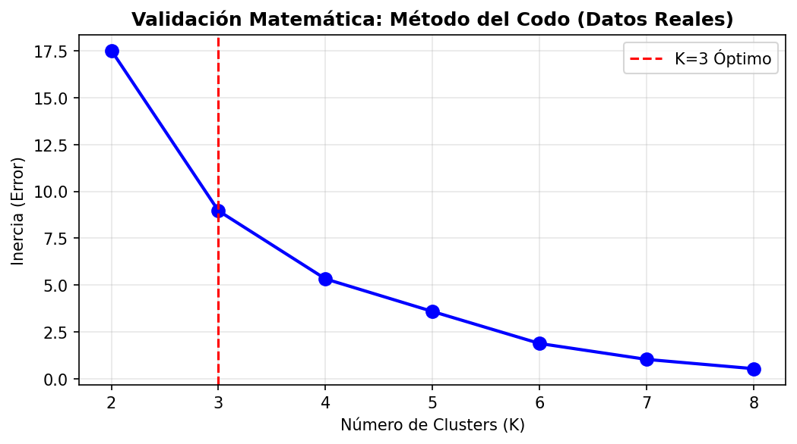
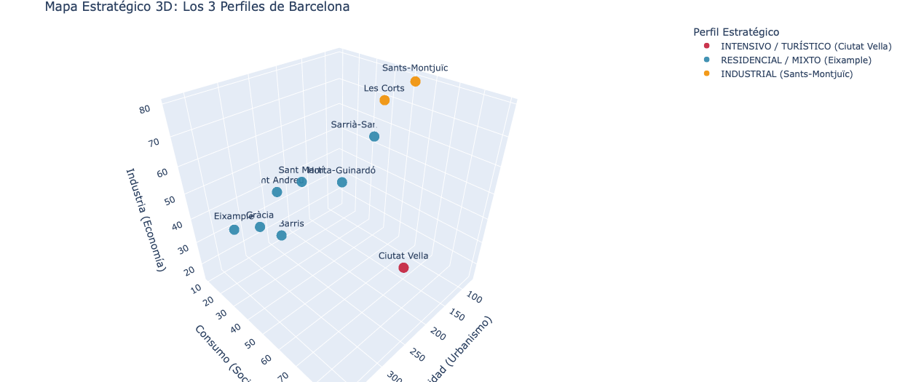
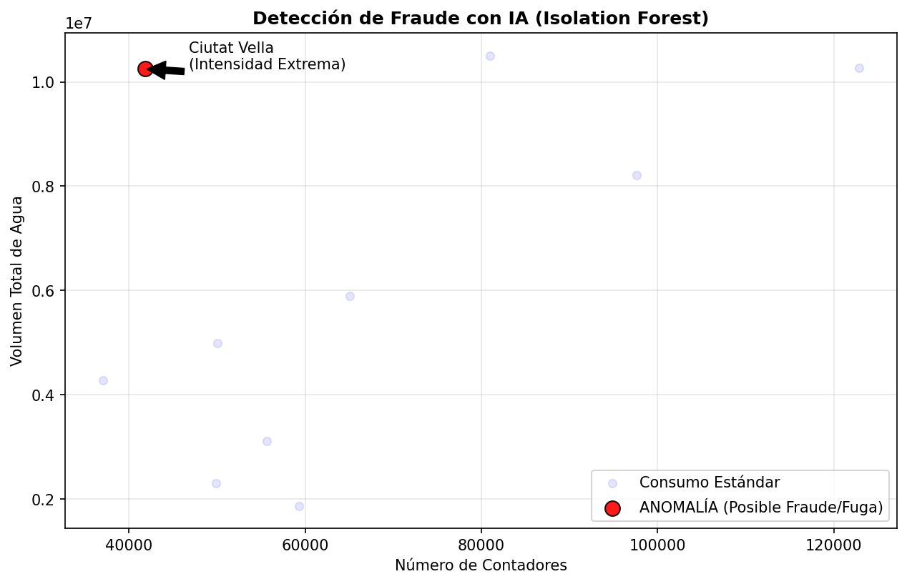
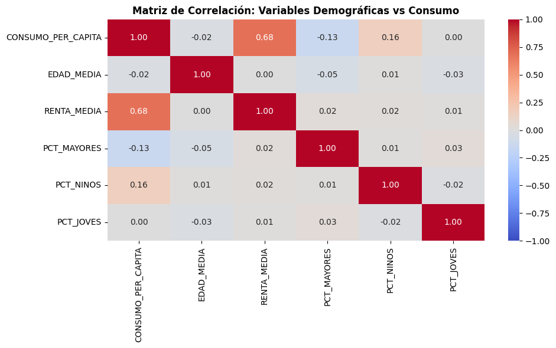

# Análisis del Consumo de Agua en Barcelona (2023-2024)

Análisis exhaustivo de 963,419 registros de consumo de agua y 121,834 alertas de fugas en Barcelona, identificando patrones de consumo, distritos críticos y oportunidades de ahorro.

---

## Resumen Ejecutivo

- **52.9%** del consumo es industrial/intensivo
- **Top 3 distritos** concentran el **50.3%** del consumo total
- **Sants-Montjuïc** representa el **25.6%** del consumo industrial
- **24%** de fugas son reiteradas (no reparadas a tiempo)
- **Machine Learning & AI**: Identificación de **3 perfiles de barrios** (K-Means) y detección automática de **anomalías/fraude** (Isolation Forest).

---

## Hallazgos Clave

### 1. Concentración Geográfica


**Top 3 distritos críticos:**
1. **Sants-Montjuïc**: 3.84 Giga L/día (17.0%)
2. **Eixample**: 3.75 Giga L/día (16.6%)
3. **Ciutat Vella**: 3.74 Giga L/día (16.6%)

---

### 2. Distribución por Tipo de Uso


| Tipo | % Consumo | Intensidad | Contadores Est. |
|------|-----------|------------|-----------------|
| Industrial | 52.9% | 9,671 L/día/contador | ~3,400 |
| Doméstico | 33.6% | 35 L/día/contador | ~595,000 |
| Comercial | 13.5% | 135 L/día/contador | ~61,000 |

**Insight:** Un contador industrial consume **277× más** que uno doméstico.

### La Anomalía de Ciutat Vella

Investigamos por qué Ciutat Vella tiene una intensidad extrema (**245 L/contador**) frente al Eixample (**83 L/contador**) pese a tener volúmenes totales similares.



**El Hallazgo:**
* El consumo "doméstico" en **Ciutat Vella** es de **122 L/día** (4x la media del Eixample: 28 L/día).
* **Conclusión:** Gran parte del parque residencial de Ciutat Vella son en realidad pisos turísticos o actividades encubiertas, lo que valida su clasificación como **foco de fraude/fugas**.
---

### 3. Segmentación Avanzada (Data Science)

Utilizando algoritmos de Machine Learning (**K-Means**) y análisis de correlación, hemos profundizado en el comportamiento poblacional.

**A. Validación Matemática:**
Validamos el número óptimo de clusters mediante el **Método del Codo**, confirmando que **K=3** es la división más eficiente para los 10 distritos.



**B. Perfiles Identificados (Clustering K=3):**

El modelo ha segmentado la ciudad en tres arquetipos de comportamiento hídrico:

*  **PERFIL INTENSIVO / TURÍSTICO (Ciutat Vella):**
    * *Característica:* Consumo per cápita extremo (**>89 L/hab**) y baja vocación industrial.
    * *Diagnóstico:* Anomalía provocada por población flotante (turismo) y actividad comercial.

*  **PERFIL INDUSTRIAL (Sants-Montjuïc, Les Corts):**
    * *Característica:* Alta intensidad por contador y **>60%** de consumo industrial.
    * *Diagnóstico:* Distritos productivos con grandes consumidores unitarios.

*  **PERFIL RESIDENCIAL COMPACTO (Eixample, Gràcia, Sant Martí...):**
    * *Característica:* Alta densidad poblacional y consumo per cápita eficiente (**<40 L/hab**).
    * *Diagnóstico:* El estándar de consumo doméstico de la ciudad.

**C. Visualización 3D Interactiva:**
Mapeo tridimensional estratégico que cruza las tres variables clave de gestión:
* **Eje X (Urbanismo):** Densidad de Población.
* **Eje Y (Social/Fraude):** Consumo Per Cápita (donde destaca Ciutat Vella).
* **Eje Z (Económico):** % Industrial (donde destaca Sants-Montjuïc).

[](https://dragoscalin33.github.io/Aguas_Barcelona_Consumo_2023_2024/visualizaciones/fase6_clusters_3d_interactivo.html)

*(Haz clic en la imagen para abrir la versión interactiva)*

---

### 4. Análisis de Riesgo (RCI/IIC)


**Distritos de ALTO riesgo:**
- **Sants-Montjuïc**: RCI 25.6%, IIC 14.4k L/día
- **Les Corts**: RCI 10.0%, IIC 16.2k L/día
- **Eixample**: RCI 15.1%, IIC 9.7k L/día

---

### 5. Análisis Geoespacial (GIS)

Hemos consolidado toda la información geográfica en un **Mapa Maestro Interactivo**.
Este visor GIS permite a los técnicos activar y desactivar capas para cruzar variables clave al instante:

| Capa Activa | Insights Visuales |
| :--- | :--- |
| **1. Volumen Total** | Identifica la mancha de consumo masivo en **Sants-Montjuïc** (Industrial). |
| **2. Intensidad** | Revela la "fábrica invisible" de servicios en el **Eixample**. |
| **3. Per Cápita** | Aísla la anomalía turística de **Ciutat Vella** (zona oscura en el centro). |

[](https://dragoscalin33.github.io/Aguas_Barcelona_Consumo_2023_2024/mapas/mapa_maestro_barcelona.html)

*(Haz clic en la imagen para abrir el visor GIS con control de capas)*

---

### 6. Análisis de Fugas y Eficiencia Operativa


Se procesaron **121,834 alertas**, revelando graves ineficiencias operativas:

* **La Paradoja Estacional (Q1 vs Q3):**
    * **Invierno (Q1):** Alto volumen de alertas (~41k) pero de impacto mínimo (goteos/ruido).
    * **Verano (Q3):** Mismo volumen de alertas (~43k) pero **5 veces más pérdida de agua** (5.0M Litros).
    * *Conclusión:* El estrés térmico provoca roturas estructurales masivas en verano.
* **Desigualdad Extrema:** La fuga mediana es de **23 L/día**, pero se han detectado "fugas monstruo" de hasta **6,200 L/día**. Tratar todas las alertas con la misma prioridad es un error estratégico.
* **Ineficiencia:** El **24.2%** de las fugas son reiteradas (no resueltas a la primera).

---

### 7. Inteligencia Artificial para Detección de Fraude

Hemos implementado un algoritmo de **Isolation Forest** (Fase 7) para detectar anomalías que escapan a las reglas simples:



* **El Hallazgo:** El modelo marcó automáticamente al **Distrito 01 (Ciutat Vella)** como una anomalía estadística.
* **La Razón:** Su ratio de **Intensidad (245 L/contador)** se desvía significativamente de la norma, sugiriendo fugas estructurales en la red antigua o fraude en locales turísticos no declarados.

---

## Recomendaciones Priorizadas

### PRIORIDAD 1: Auditoría en Ciutat Vella (Inmediata)
- **Acción**: Inspección técnica de la red en el Distrito 1.
- **Justificación**: Marcado como "Anomalía" por la IA debido a su intensidad desproporcionada (245 L/contador).

### PRIORIDAD 2: Plan de Choque Industrial
- **Acción**: Auditoría dirigida a **1,287 grandes contadores** estratégicos en Sants-Montjuïc, Eixample y Les Corts.
- **Impacto**: Con solo el **0.1%** de las inspecciones, se controla el **60%** del consumo industrial total.
- **Objetivo**: Recuperación estimada de **600 Millones de Litros/día** (detectando un 10% de ineficiencia).

### PRIORIDAD 3: Inspección de Fraude (IA)
- **Acción**: Revisión in-situ del 1% de anomalías detectadas por Isolation Forest.
- **Objetivo**: Recuperación de ingresos y detección de tomas ilegales.

### PRIORIDAD 4: Estrategia Segmentada por Perfiles
- **Acción**: Campañas de concienciación diferenciadas según el Cluster detectado.
    - *Cluster A (Turístico):* Control de licencias y eficiencia en hostelería.
    - *Cluster B (Residencial):* Foco en comunidades de vecinos y ahorro doméstico.

### PRIORIDAD 5: Protocolo de Calidad (Fugas Reiteradas)
- **Acción**: Implementar auditoría de calidad post-reparación y análisis de causa raíz en incidencias repetitivas.
- **Objetivo**: Reducir la tasa de reiteración del 24% a <10%.

---

## Metodología

- **Datasets**: 963,419 registros consumo (2023) + 121,834 alertas fugas (2024)
- **Stack Tecnológico**: 
  - **Procesamiento:** Python, Pandas, NumPy.
  - **Machine Learning & AI:** Scikit-learn (K-Means, Isolation Forest, Correlación de Pearson).
  - **Visualización:** Matplotlib, Seaborn, Folium.
- **Métricas**:
  - **RCI**: Riesgo de Concentración Industrial
  - **IIC**: Intensidad de Consumo Industrial
  - **Consumo per cápita**: L/día por habitante

📄 **[Ver Informe Ejecutivo Completo](INFORME_EJECUTIVO.md)**

---

## Estructura del Proyecto
```
📁 Analisis-Consumo-Agua-Barcelona/
├── 📄 README.md (este archivo)
├── 📄 INFORME_EJECUTIVO.md (informe completo)
├── 📁 notebooks/ (código Jupyter)
├── 📁 data/ (datasets originales)
├── 📁 mapas/ (mapas HTML interactivos)
├── 📁 visualizaciones/ (gráficos PNG)
```

---

## Visualizaciones Adicionales

### A. Validación Estadística (Machine Learning)



**Hallazgo Crítico (Respuesta a la Hipótesis):**
* **Edad vs Consumo:** El mapa de calor muestra un coeficiente casi nulo (**0.02**), demostrando que una población más envejecida no implica necesariamente un menor o mayor consumo.
* **Densidad vs Consumo:** Se observa una correlación inversa, indicando que los barrios más compactos tienden a ser más eficientes en el uso del agua per cápita.

### B. Correlaciones Operativas


**Hallazgo:** Correlación extrema (**r=0.98**) entre intensidad de contador y consumo per cápita, confirmando que los grandes consumidores distorsionan la media distrital.

### C. Composición por Distrito


**Hallazgo:** Dicotomía clara (r=-0.96) entre distritos industriales y domésticos.

---

## Contacto

**Autor**: Dragos Calin

**LinkedIn**: https://www.linkedin.com/in/dragos-calin33/ 

**Email**: dragoscalin@yahoo.com

---

## Validación Profesional y Próximos Pasos

Este proyecto ha sido revisado por expertos del sector hídrico, validando la utilidad del algoritmo **Isolation Forest** para la detección de fraude real mediante la identificación de roturas de estacionalidad.

**Hoja de Ruta (Next Steps):**
Basado en el feedback industrial recibido, las próximas iteraciones del modelo integrarán:
1.  **Variables Hidráulicas:** Incorporación de datos de presión y velocidad de caudal para correlacionar con roturas.
2.  **Infraestructura Física:** Modelado predictivo cruzando la antigüedad y material de la red de tuberías.
3.  **Segmentación Operativa:** Análisis granular por zonas de presión hidráulica (más allá del código postal).

---

## Fuentes de Datos
Agradecimiento a las instituciones que facilitan el acceso a datos públicos para la investigación:
- [Open Data BCN](https://opendata-ajuntament.barcelona.cat/)
- [Idescat](https://www.idescat.cat/)

---

## Licencia

* Este proyecto está bajo licencia MIT. 
* Ver [LICENSE](LICENSE) para más detalles.
